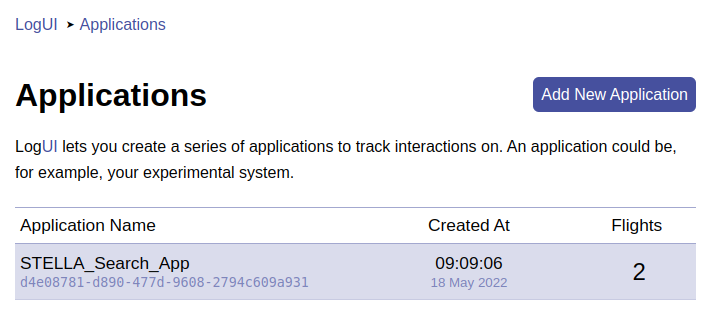
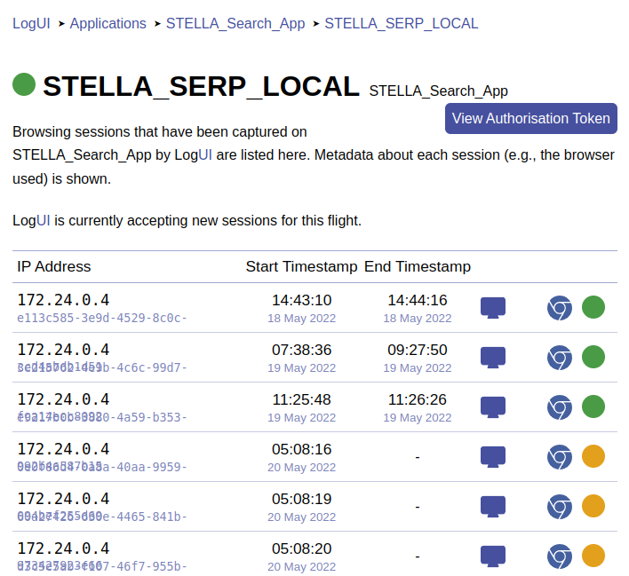

**LoguI Server Setup**  
Useful snippets for starting and first navigating the LogUI server set up.

Create Environment File
```
cd logui-server/scripts/
./create_env.sh
cd ..
```

Build LogUI server container images
```
cd logui-server
docker-compose -p logui build
docker-compose -p logui pull
```

Start LogUI Server
```
docker-compose -p logui up
```

Create user account
```
cd scripts
./create_user.sh your_user_name
```

Stop LogUI Server
```
docker-compose -p logui down
```

## LogUI Control App


