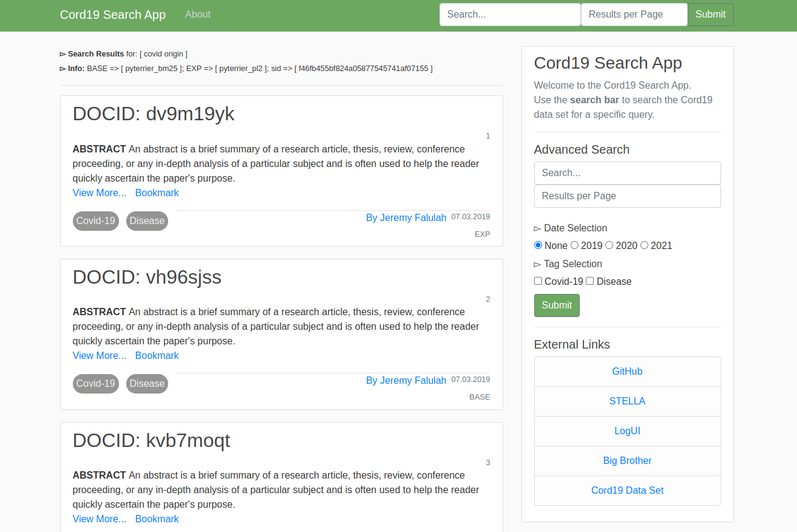
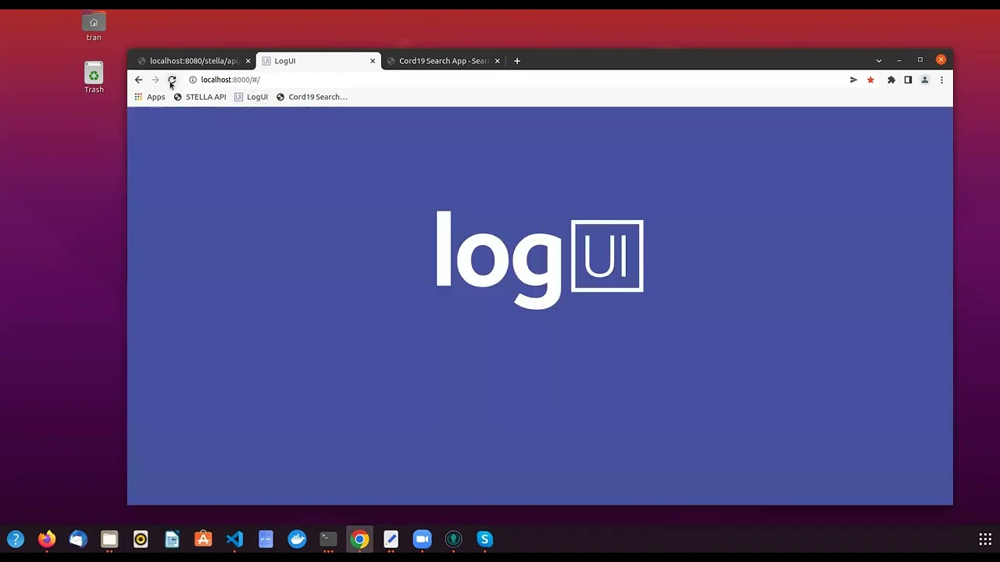

# Integration of Logging Frameworks into the STELLA Infrastructure
```
A Flask Search App integrated with STELLA APP and logged by LogUI and BigBrother
```
* Cord19 Search App available at: [http://localhost:5000/](http://localhost:5000/)
* Document Retrieval with [STELLA](https://github.com/stella-project) and the [Cord19 Data Set](https://github.com/allenai/cord19)
* Automated Logging enabled with [LogUI](https://github.com/logui-framework) available at: [http://localhost:8000/](http://localhost:8000/)
* Alternative Logging enabled with [Big Brother](https://github.com/hscells/bigbro)  

## Cord19 Search App


## Video DEMO

| Video Demonstrations |
| ----------- | 
|[↓↓ LOGUI with STELLA DEMO ↓↓](https://www.youtube.com/watch?v=D47EbID5j14 "")|
|[](https://www.youtube.com/watch?v=D47EbID5j14)|

## Table of contents
- [Video DEMO](#video-demo)
- [Prerequisites](#prerequisites)
- [How to use](#how-to-use)
  - [Installation](#installation)
  - [Getting Started](#getting-started)
  - [Troubleshooting](#troubleshooting)
- [Further Research](#further-research)
- [Sources](#sources)
- [Acknowledgements](#acknowledgements)


## Prerequisites
* Python >= 3.6
* Java >= 11
* Docker
* Docker-compose
* Go / Golang

Recommended and tested under Ubuntu 20.04

## How to use
1. In order to fully utilize this repository, it is recommmended to set up the STELLA APP, Big Brother Server and the LogUI Server first before running the Flask Search Apps.  
2. Once they do, running the Flask Search App will automatically initiate either the LogUI or the Big Brother Client upon the first DOM model load. For this purpose, the repository offers two types of search apps:  
    -**search-app** with LogUI client-side scripting and **search-app-alternative** for Big Brother's client-side scripting
4. Upon successful websocket connection with their respective servers, LogUI or Big Brother will commence actively logging key user interactions.

LogUI's custom event coding is defined in the [configuration object](https://github.com/AH-Tran/STELLA_LogUI/blob/main/search-app/static/logui_config.js), while Big Brother's configuration has been kept very default, making it log pretty much everything.
### Installation

For the basic flask requirements:
```
pip3 install -r requirements.txt
```

For setting up the STELLA APP, refer to the documentation over here: [STELLA Pyterrier Doc](https://stella-project.org/stella-documentation/guides/pyterrier/)

For setting up LogUI, consult its excellent documentation:
[First Run Server Guide](https://github.com/logui-framework/server/wiki/First-Run-Guide) |
[First Run Client Guide](https://github.com/logui-framework/client/wiki/Quick-Start-Guide)


For setting up the Big Brother server, use this command and refer to the BigBro's README for further info and extra tools: [Big Bro README](https://github.com/hscells/bigbro)
```
go install github.com/hscells/bigbro/cmd/bigbro
```

### Getting Started
1. Start from the repository's root-directory 

2. Run STELLA:
```
docker-compose -f stella-app/yml/pyterrier.yml up -d
```
3. Run LogUI Server and LogUI Control App:
```
cd logui-server
```
```
docker-compose -p logui up
```

4. Run the respective flask via
```
cd search-app
```
```
python search_app.py
```
Access the Search app at [http://localhost:5000/](http://localhost:5000/) and start logging.

### Troubleshooting
Both the STELLA Dashboard and the LogUI Control App might want to occupy the same port localhost:8000 by default. Consider changing the port of either via STELLA's docker-compose file or LogUI's docker-compose file.

## Further Research
On further hinsight, it would be interesting to pursue additional interactive dashboarding tools to complement LogUI's and Big Brother's consistent logging features. With that, one could realistically create a live analytics dashboard, where new user interaction data is constantly fed into the dashboard, enabling researchers to observe and follow a user's journey in real time.

## Sources
[STELLA](https://stella-project.org/)  
[LogUI](https://github.com/logui-framework)  
[Big Brother](https://github.com/hscells/bigbro)  

## Acknowledgements
Many thanks to Timo Breuer and the Information Retrieval Research Group for developing and providing the STELLA Infrastructure for this thesis, with which it was possible to integrate logging frameworks in a readily available living lab environment.

Another thanks to David Maxwell for developing and providing the LogUI framework, but also the very detailed LogUI documentation, with which it became easier to integrate LogUI into the STELLA framework and troubleshoot problems in case of unforeseen errors.

And a final thanks to Harry Scells, Jimmy and Guido Zuccon for providing the Big Brother service, that I could use as a comparison with the LogUI framework when it comes to modern, contemporary logging solutions with a decidedly different focus.
