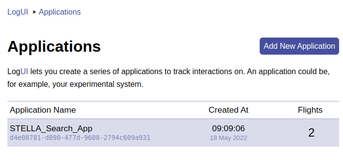
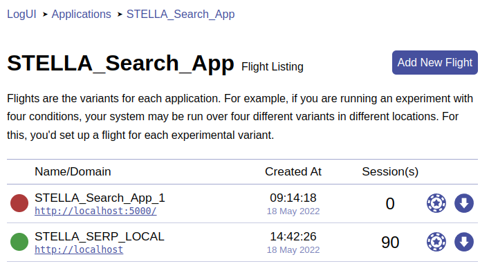
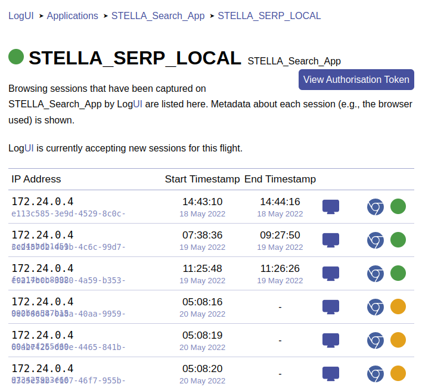

# Integration of Logging Frameworks into the STELLA Infrastructure
```
A Flask Search App integrated with STELLA and logged by LogUI and BigBrother
```
* Cord19 Search App available at: [http://localhost:5000/](http://localhost:5000/)
* Document Retrieval with STELLA and the [Cord19 Data Set](https://github.com/allenai/cord19)
* Automated Logging enabled with [LogUI](https://github.com/logui-framework) available at: [http://localhost:8000/](http://localhost:8000/)
* Alternative Logging enabled with [Big Brother](https://github.com/hscells/bigbro)  

## Cord19 Search App


## Table of contents
- [Prerequisites](#rerequisites)
- [How to use](#how-to-use)
  - [Installation](#installation)
- [Important Scripts](#important-scripts)
- [Troubleshooting](#troubleshooting)
- [Sources](#sources)
- [Acknowledgements](#acknowledgements)
- [Further Research](#further-research)
- [Images](#images)


## Prerequisites:  
* Python >= 3.6
* Java 11 or higher
* Docker
* Docker-compose

Tested under Ubuntu 20.04

## How to use
Placeholder

### Installation
Placeholder

**Requirements.txt**  
```
pip3 install -r requirements.txt
```
**LoguI Server Setup**  
Create Environment File
```
cd logui-server/scripts/
./create_env.sh
cd ..
```

Build LogUI server container images
```
cd logui-server
docker-compose -p logui build
docker-compose -p logui pull
```

Start LogUI Server
```
docker-compose -p logui up
```

Create user account
```
cd scripts
./create_user.sh your_user_name
```

Stop LogUI Server
```
docker-compose -p logui down
```

## Important Scripts
Placeholder

## Troubleshooting
Websocket Connectivity Instructions HERE

## Sources
Placeholder

## Acknowledgements
Placeholder

## Further Research
Placeholder

## Images



